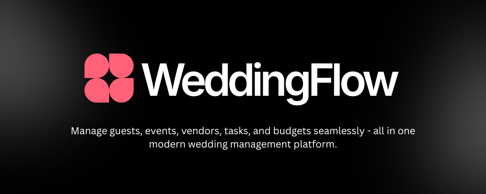

**Plan Your Wedding. Without the Chaos.**

WeddingFlow is a modern, high-performance wedding management platform designed to help couples plan their big day without the chaos. From guest lists to vendor tracking, manage every detail of your wedding in one elegant and intuitive interface.

## ✨ Features

- **Guest Management**: Keep track of RSVPs, dietary requirements, and seating arrangements.
- **Event Planning**: Organize multiple events like the rehearsal dinner, ceremony, and reception.
- **Vendor Tracking**: Store contracts, contact info, and payment statuses for all your vendors.
- **Task & Budget**: Stay on top of your to-do list and monitor your spending in real-time.
- **Modern Responsive UI**: Fully optimized for both desktop and mobile using a custom responsive component system.

## 🚀 Tech Stack

- **Framework**: [Next.js 16+](https://nextjs.org) (App Router)
- **Language**: [TypeScript](https://www.typescriptlang.org/)
- **Styling**: [Tailwind CSS 4](https://tailwindcss.com/)
- **Authentication**: [Better Auth](https://better-auth.dev/)
- **Database**: [PostgreSQL](https://www.postgresql.org/)
- **ORM**: [Drizzle ORM](https://drizzleorm.com/)
- **UI Components**: [Shadcn UI](https://ui.shadcn.com/), [Radix UI](https://www.radix-ui.com/)
- **Icons**: [Hugeicons](https://hugeicons.com/)
- **Package Manager**: [Bun](https://bun.sh/)

## 🛠️ Getting Started

### Prerequisites

- [Bun](https://bun.sh/) installed on your machine.

### Installation

You can get the project up and running locally with the following steps:

1.  **Clone the repository:**

    ```bash
    git clone https://github.com/asadsid004/weddingflow.git
    cd weddingflow
    ```

2.  **Install dependencies:**

    ```bash
    bun install
    ```

3.  **Set up environment variables:**

    Copy the example environment file and fill in your credentials:

    ```bash
    cp .env.example .env
    ```

    You'll need to provide:
    - `DATABASE_URL`: Your PostgreSQL connection string.
    - `BETTER_AUTH_SECRET`: A secure random string for authentication.
    - `GOOGLE_CLIENT_ID` & `GOOGLE_CLIENT_SECRET`: For Google Sign-In.

4.  **Set up the database:**

    Push the schema to your database:

    ```bash
    bun db:push
    ```

5.  **Run the development server:**
    ```bash
    bun dev
    ```

Open [http://localhost:3000](http://localhost:3000) with your browser to see the result.

## 📖 Available Scripts

- `bun dev` - Starts the development server.
- `bun build` - Builds the application for production.
- `bun start` - Starts the production server.
- `bun lint` - Runs ESLint to check for code quality issues.
- `bun db:push` - Pushes the Drizzle schema to the database.
- `bun db:generate` - Generates SQL migrations.
- `bun db:migrate` - Runs pending migrations.
- `bun db:studio` - Opens Drizzle Studio to explore your data.
